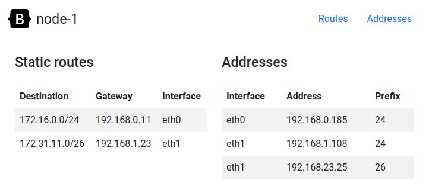
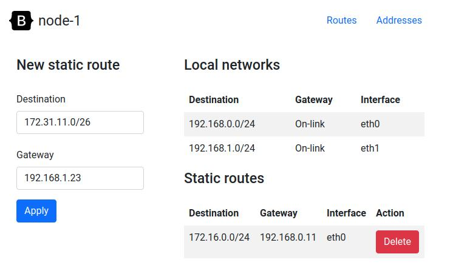
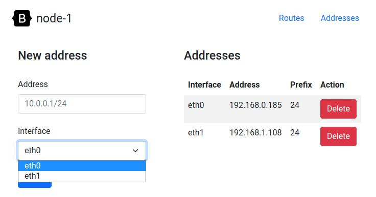

# netlink-manager

Web UI to manage static routes and network addresses with netlink.


## Requirements

* RHEL / CentOS 7
* Python 3.6+
* Running as root (only root can use netlink socket)


## Installation

Prepare a server and install the latest version:
```sh
ansible-playbook -i srv-app-01, deploy/main.yml
```

Updating:
```sh
ansible-playbook -i srv-app-01, deploy/deploy.yml
```


## Usage






